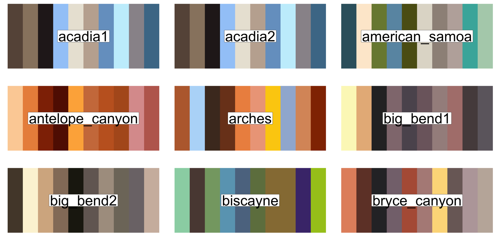
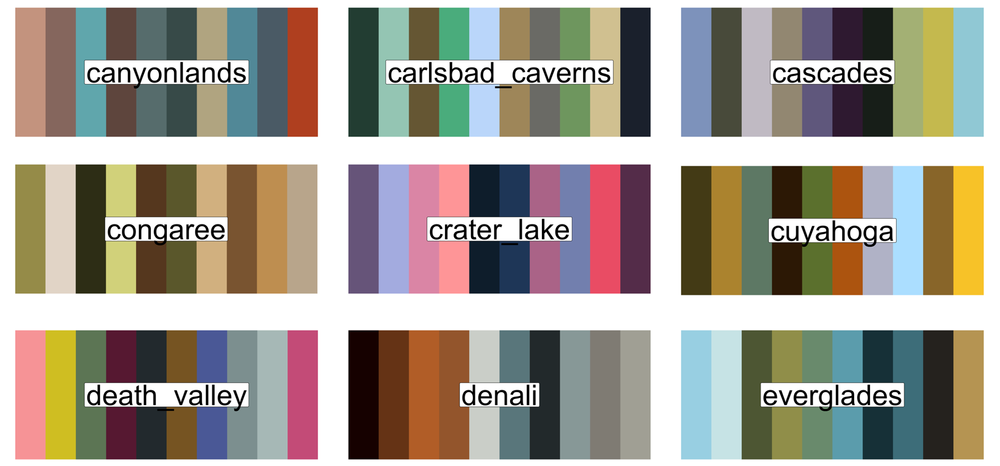
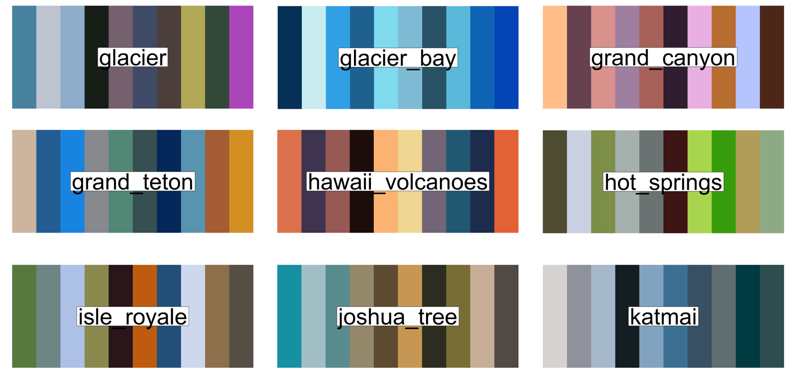
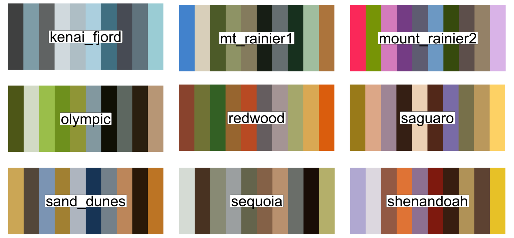
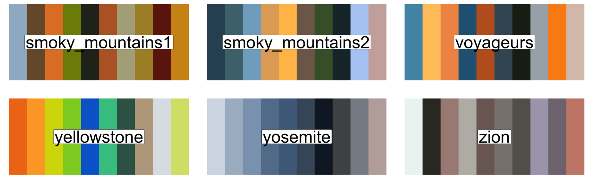
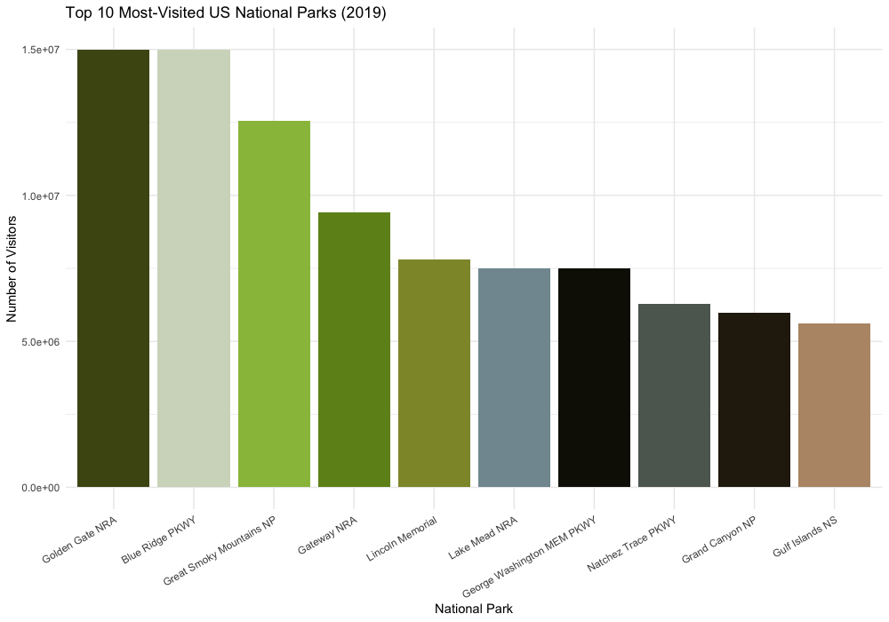
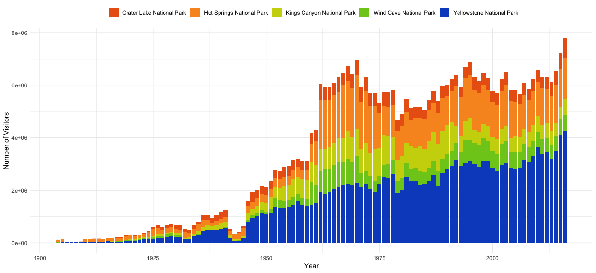

This package contains color palettes for R data visualization that are inspired by the United States National Parks. We are just two PhD candidates who love pretty graphs and the outdoors. We are in no way associated with the National Park Service (unfortunately). 

## Install
To install the package, run the following in your `R` console: `devtools::install_github("sarahlotspeich/paRkpal")`. 

## Available parks & palettes 







# Examples
## Most-Visited US National Parks (2019)

We demonstrate use of the `paRkpal` package using the `NationalParkVisits_2019` data.

```{r}
# Run once: devtools::install_github("sarahlotspeich/paRkpal")`
library(paRkpal)`
library(ggplot2)

visits <- read.csv("https://raw.githubusercontent.com/sarahlotspeich/nationalpaRkpalettes/master/data/NationalParkVisits_2019.csv")

top10 <- visits[visits$Rank <= 10, ] # Subset to 10 most-visited parks 
top10$ParkName <- factor(top10$ParkName, levels = top10$ParkName)`

ggplot(data = top10) + 
  geom_bar(aes(x = ParkName, y = Value, fill = ParkName), stat = "identity") + 
  scale_fill_manual(values = park_palette("olympic"), guide = F) + 
  xlab("National Park") + ylab("Number of Visitors") + 
  theme_minimal() +
  theme(axis.text.x = element_text(angle = 30, hjust = 1))
```



Data source: https://irma.nps.gov/Stats/SSRSReports/National%20Reports/Annual%20Park%20Ranking%20Report%20(1979%20-%20Last%20Calendar%20Year)


## Annual Visits to the Five Oldest National Parks (1904--2016)

The five oldest parks, with data going all the way back to 1904, are Hot Springs, Yellowstone, Wind Cave, Crater Lake, and Kings Canyon. We read in the `ParkAttendance_1904_2016` data and subset to these parks.

```{r}
read.csv("https://raw.githubusercontent.com/sarahlotspeich/paRkpal/master/data/ParkAttendance_1904_2016.csv", stringsAsFactors = F) %>% 
  dplyr::filter(Unit.Name %in% c("Hot Springs National Park", "Yellowstone National Park",
                                 "Wind Cave National Park", "Crater Lake National Park",
                                 "Kings Canyon National Park")) -> oldest5

oldest5 %>% 
  ggplot(aes(x = Year, y = as.numeric(Visitors), fill = Unit.Name)) + 
  geom_bar(stat = "identity") +
  scale_fill_manual(values = park_palette("yellowstone"), name = "") + 
  xlab("Year") + ylab("Number of Visitors") + 
  theme_minimal() + theme(legend.position = "top")
```



Data source: https://data.world/garyhoov/national-parks-sorted-by-total-attendance-and-by-year


## Animal Species Recorded in the National Park System

The National Park Service publishes a database of plant and animal species identified and verified to be present in indiviual national parks. These records are made available to the public on the National Park Species Portal (though exceptions are made for threatened species). Lots of interesting metadata can be found in these records, including categories of species found in parks, taxonomic rankings, scientific and common names, nativeness, etc. We read in the entirety of this available data to show what categories of animals make up a larger proportion of recordings in different parks.

```{r}
species <- read.csv("https://raw.githubusercontent.com/brchalifour/paRkpal/master/data/species.csv")

speciesTally <- species %>% group_by(Park_Name, Category) %>% tally()

animalTally <- speciesTally %>% dplyr::filter(!(Category %in% c("Vascular Plant", "Nonvascular Plant", "Algae", "Fungi")))
                      
ggplot(animalTally, aes(fill=Category, y=n, x=Park_Name)) + 
  geom_bar(stat="identity", position = "fill") +
  scale_fill_manual(values = park_palette("death_valley")) +
  theme_minimal() +
  labs(y="Proportion of Species Recorded", x="Category") +
  theme(axis.title.x = element_blank()) +
  theme(legend.text=element_text(size=12), legend.title=element_text(size=14,face="bold")) +
  theme(axis.text=element_text(size=10),
        axis.title=element_text(size=14,face="bold")) +
  theme(axis.title.y = element_text(margin = margin(t = 0, r = 20, b = 0, l = 0))) +
  theme(axis.text.x = element_text(angle = 90, hjust = 1))
```


Data source: https://irma.nps.gov/NPSpecies
